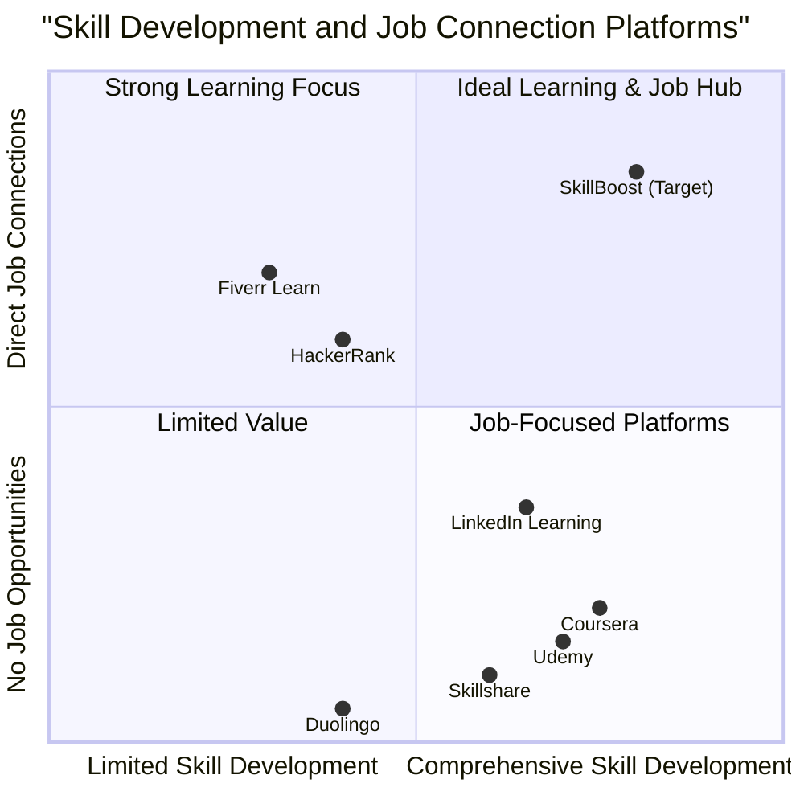

# Product Requirements Document: SkillBoost

## Project Information

- **Project Name:** skill_boost
- **Date:** 2025-05-26
- **Document Version:** 1.0

## Original Requirements

Create a responsive web application called SkillBoost with the following key features:

1. Onboarding screen to collect user skills and goals
2. Daily 5-minute skill screen
3. Job board for entry-level gigs
4. Chat screen for AI skill coaching
5. Rewards and progress tracker

## 1. Product Definition

### 1.1 Product Goals

1. **Skill Development:** Empower users to develop marketable skills through structured, bite-sized daily learning experiences that fit into busy schedules.

2. **Employment Opportunities:** Connect users with entry-level gig opportunities that match their developing skills, creating a direct pathway from learning to earning.

3. **Personalized Growth:** Provide AI-powered coaching and personalized progress tracking to keep users motivated and guide their skill development journey.

### 1.2 User Stories

1. **As a recent graduate**, I want to build practical skills daily in small time increments, so that I can become more employable without feeling overwhelmed.

2. **As a career changer**, I want to identify skills that are in demand for my desired industry, so that I can focus my learning efforts efficiently.

3. **As a freelancer**, I want to discover entry-level gigs that match my current skills, so that I can start building my portfolio while continuing to learn.

4. **As a busy professional**, I want to integrate skill development into my daily routine in 5-minute segments, so that I can advance my career without disrupting my schedule.

5. **As a self-directed learner**, I want to receive personalized guidance and feedback on my learning journey, so that I can stay motivated and focused on relevant skills.

### 1.3 Competitive Analysis

| Competitor | Strengths | Weaknesses |
|------------|-----------|------------|
| **LinkedIn Learning** | - Large library of courses<br>- Professional networking<br>- Industry recognition | - Lengthy course formats<br>- Limited personalization<br>- No direct job matching<br>- No micro-learning |
| **Duolingo** | - Excellent micro-learning format<br>- Strong gamification<br>- Habit-forming UX<br>- Effective mobile design | - Limited to language learning<br>- No job opportunities<br>- Limited career relevance |
| **Fiverr Learn** | - Direct connection to gig platform<br>- Practical skill focus<br>- Industry relevance | - Courses are too long<br>- Limited personalization<br>- No continuous learning model |
| **Coursera** | - High-quality content<br>- Recognized certificates<br>- Comprehensive courses | - Time-intensive courses<br>- Limited job connections<br>- No micro-learning |
| **Skillshare** | - Project-based learning<br>- Creative skill focus<br>- Community features | - No direct job connections<br>- Variable content quality<br>- No personalized learning paths |
| **Udemy** | - Vast course selection<br>- Lifetime access<br>- Frequent discounts | - Inconsistent quality<br>- Long-form courses<br>- No personalized coaching |
| **HackerRank** | - Skill assessment focus<br>- Direct job connections<br>- Technical skill validation | - Limited to coding skills<br>- No guided learning paths<br>- No daily practice feature |

### 1.4 Competitive Quadrant Chart



## 2. Technical Specifications

### 2.1 Requirements Analysis

The SkillBoost web application will be a responsive platform accessible on both desktop and mobile devices, with a primary focus on mobile user experience. It will combine micro-learning techniques with direct job matching to provide users with a comprehensive skill development and career advancement solution.

The core premise is that users can make meaningful skill progress in just 5 minutes per day, while concurrently gaining access to entry-level opportunities that match their developing skillset. The AI coaching component ensures that users receive personalized guidance without requiring human mentors.

The gamification elements and reward system are designed to maintain engagement and motivation throughout the user's skill development journey, leveraging proven behavioral psychology principles.

The application requires user authentication, personalized content delivery, data analysis for job matching, and real-time communication for the AI coaching feature.

### 2.2 Requirements Pool

#### P0 (Must-Have)

1. **User Authentication & Profile Management**
   - User registration and login functionality
   - Secure authentication system
   - User profile creation and management
   - Skill and goal tracking mechanisms

2. **Onboarding Experience**
   - Initial skill assessment
   - Goal setting interface
   - Personalization preferences
   - Learning path generation

3. **Daily 5-Minute Skill Activities**
   - Micro-learning content delivery system
   - Timer functionality for timed exercises
   - Daily challenge completion tracking
   - Content relevance to user's goals

4. **Job Board for Entry-Level Gigs**
   - Job listing display with filtering options
   - Skill-to-job matching algorithm
   - Application functionality
   - Saved jobs feature

5. **Progress Tracking**
   - Skill development metrics
   - Completion statistics
   - Visualization of progress
   - Streak and consistency tracking

#### P1 (Should-Have)

1. **AI Coaching Chat**
   - Natural language processing capabilities
   - Personalized advice and recommendations
   - Resource suggestions based on goals
   - Learning path adjustments

2. **Rewards System**
   - Achievement badges
   - Point accumulation system
   - Reward redemption options
   - Milestone celebrations

3. **Social Features**
   - Optional skill sharing
   - Achievement comparisons
   - Community challenges
   - Peer support options

4. **Notification System**
   - Daily reminders
   - Job opportunity alerts
   - Achievement notifications
   - Streak maintenance reminders

5. **Content Recommendation Engine**
   - Personalized learning suggestions
   - Skill gap analysis
   - Market demand insights
   - Learning path optimization

#### P2 (Nice-to-Have)

1. **Premium Content Integration**
   - Partnership with content providers
   - Advanced skill modules
   - Industry certification preparation

2. **Employer Dashboard**
   - For companies to post opportunities
   - Candidate matching features
   - Direct communication channels

3. **Advanced Analytics**
   - Detailed learning patterns
   - Time investment analytics
   - Skill development projections
   - Industry trend analysis

4. **Offline Access**
   - Cached daily challenges
   - Limited functionality without internet
   - Sync when connection restored

5. **Advanced Personalization**
   - Learning style adaptation
   - Content format preferences
   - Adaptive difficulty scaling
   - Custom learning schedules


### 2.3 UI Design Draft

#### Responsive Mobile-First Design

The application will be designed with a mobile-first approach, ensuring optimal user experience across all devices, with particular attention to mobile usability.

#### Key Screens

##### 1. Onboarding Screen

```
┌─────────────────────────┐
│        SkillBoost       │
│                         │
│  ┌─────────────────┐    │
│  │    Welcome!     │    │
│  │                 │    │
│  │  Let's get you  │    │
│  │  started on     │    │
│  │  your skill     │    │
│  │  journey        │    │
│  └─────────────────┘    │
│                         │
│  [Next]                 │
│                         │
└─────────────────────────┘

┌─────────────────────────┐
│  What are your current  │
│  skills?                │
│                         │
│  [ ] Programming        │
│  [ ] Design             │
│  [ ] Writing            │
│  [ ] Marketing          │
│  [ ] Data Analysis      │
│  [+] Add Custom Skill   │
│                         │
│  [Back]       [Next]    │
│                         │
└─────────────────────────┘

┌─────────────────────────┐
│  What are your goals?   │
│                         │
│  ○ Find a new job       │
│  ○ Advance in career    │
│  ○ Learn new skills     │
│  ○ Start freelancing    │
│  ○ Other                │
│                         │
│  [Back]       [Finish]  │
│                         │
└─────────────────────────┘
```

##### 2. Daily 5-Minute Skill Screen

```
┌─────────────────────────┐
│        SkillBoost       │
│                         │
│  ┌─────────────────┐    │
│  │  Today's Skill  │    │
│  │     Challenge   │    │
│  │                 │    │
│  │  JavaScript     │    │
│  │  Fundamentals   │    │
│  │                 │    │
│  │  [05:00]        │    │
│  │                 │    │
│  │  [Start Now]    │    │
│  └─────────────────┘    │
│                         │
│  Streak: 🔥 5 days      │
│                         │
└─────────────────────────┘

┌─────────────────────────┐
│  JavaScript Challenge   │
│                         │
│  ┌─────────────────┐    │
│  │     04:32       │    │
│  └─────────────────┘    │
│                         │
│  Complete the function: │
│                         │
│  function addTwo(num) { │
│    // Your code here    │
│    return              ;│
│  }                      │
│                         │
│  [Hint]      [Submit]   │
│                         │
└─────────────────────────┘

┌─────────────────────────┐
│      Challenge          │
│      Complete!          │
│                         │
│  ┌─────────────────┐    │
│  │     🎉 +10      │    │
│  │     points      │    │
│  └─────────────────┘    │
│                         │
│  You've mastered basic  │
│  JavaScript functions!  │
│                         │
│  [Next Challenge]       │
│  [Back to Dashboard]    │
│                         │
└─────────────────────────┘
```

##### 3. Job Board Screen

```
┌─────────────────────────┐
│     Job Opportunities   │
│                         │
│  ┌─────────────────┐    │
│  │ 🔍 Search jobs  │    │
│  └─────────────────┘    │
│                         │
│  Filters:               │
│  [Skills ▼] [Remote ▼]  │
│                         │
│  ┌─────────────────┐    │
│  │ Junior Web Dev  │    │
│  │ $25-35/hr       │    │
│  │ Remote          │    │
│  │ [Details]       │    │
│  └─────────────────┘    │
│                         │
│  ┌─────────────────┐    │
│  │ Content Writer  │    │
│  │ $20-30/hr       │    │
│  │ Remote          │    │
│  │ [Details]       │    │
│  └─────────────────┘    │
│                         │
└─────────────────────────┘

┌─────────────────────────┐
│   Job Details           │
│                         │
│  Junior Web Developer   │
│  TechStart Inc.         │
│                         │
│  Skills needed:         │
│  - HTML/CSS ✓           │
│  - JavaScript ✓         │
│  - React ✗              │
│                         │
│  Missing skills:        │
│  [Learn React - 14 days]│
│                         │
│  [Apply Now]            │
│  [Save Job]             │
│                         │
└─────────────────────────┘
```

##### 4. AI Coach Chat Screen

```
┌─────────────────────────┐
│      AI Skill Coach     │
│                         │
│  ┌─────────────────┐    │
│  │ Hi! How can I   │    │
│  │ help with your  │    │
│  │ skill journey   │    │
│  │ today?          │    │
│  └─────────────────┘    │
│                         │
│  ┌─────────────────┐    │
│  │ I want to learn │    │
│  │ more about      │    │
│  │ React.          │    │
│  └─────────────────┘    │
│                         │
│  ┌─────────────────┐    │
│  │ Great choice!   │    │
│  │ Based on your   │    │
│  │ progress with   │    │
│  │ JavaScript, I   │    │
│  │ recommend...     │    │
│  └─────────────────┘    │
│                         │
│  [Type a message...]    │
│  [Send]                 │
│                         │
└─────────────────────────┘
```

##### 5. Rewards & Progress Tracker Screen

```
┌─────────────────────────┐
│    Progress Tracker     │
│                         │
│  Level 5 Frontend Dev   │
│  ├────────────┤ 65%     │
│                         │
│  Weekly Streak: 🔥 5    │
│  Total Points: 350      │
│                         │
│  Recent Achievements:   │
│                         │
│  ┌─────────────────┐    │
│  │ 🏆 CSS Master   │    │
│  │ Completed all   │    │
│  │ CSS challenges  │    │
│  └─────────────────┘    │
│                         │
│  ┌─────────────────┐    │
│  │ 🔄 5-Day Streak │    │
│  │ Practiced 5     │    │
│  │ days in a row   │    │
│  └─────────────────┘    │
│                         │
│  [View All Achievements]│
│                         │
└─────────────────────────┘

┌─────────────────────────┐
│     Skill Progress      │
│                         │
│  HTML        ▓▓▓▓▓▓▓▓▓▓ 100%
│  CSS         ▓▓▓▓▓▓▓▓░░  80%
│  JavaScript  ▓▓▓▓▓░░░░░  50%
│  React       ▓░░░░░░░░░  10%
│                         │
│  Recommended Next:      │
│  [JavaScript Arrays]    │
│                         │
└─────────────────────────┘
```

### 2.4 Open Questions

1. **Content Sourcing**
   - How will we source the skill development content for various professional domains?
   - Should we partner with existing platforms or develop our own curriculum?
   - What quality control measures will ensure content is accurate and valuable?

2. **Job Board Integration**
   - Will the job board feature job postings from third-party sources or only from our platform?
   - How will we verify the legitimacy of job postings?
   - What filters and matching algorithms will ensure relevant job recommendations?

3. **AI Coach Capabilities**
   - What is the scope of the AI coach's knowledge and guidance?
   - How will we handle edge cases where the AI cannot provide accurate guidance?
   - Should we consider human coach backup for complex queries?

4. **Monetization Strategy**
   - Will the platform use a freemium model, subscription, or other revenue approach?
   - Which features should be free vs. premium?
   - How will pricing be structured to maximize user adoption while ensuring sustainability?

5. **Scaling Considerations**
   - How will the platform scale to accommodate users across different professional domains?
   - What systems need to be in place to handle growing user data and activity?
   - How will we maintain personalization quality as the user base expands?

## 3. User Personas

### 3.1 Recent Graduate - Alex

**Demographics:**
- 23 years old
- Bachelor's degree in Marketing
- Limited professional experience
- Urban dweller

**Goals:**
- Build practical skills not taught in university
- Find entry-level opportunities to start building a portfolio
- Stand out in a competitive job market

**Pain Points:**
- Overwhelmed by the gap between education and job requirements
- Limited time to devote to extensive courses
- Unsure which skills to prioritize for employability

**Usage Patterns:**
- Uses mobile devices for 70% of online activities
- Prefers learning in short sessions between other activities
- Values social proof and peer comparison

### 3.2 Career Changer - Morgan

**Demographics:**
- 35 years old
- 10+ years in traditional retail management
- Seeking transition to digital marketing
- Parent with limited dedicated study time

**Goals:**
- Efficiently acquire new skills in digital domain
- Build credibility in new field despite lack of formal experience
- Find opportunities that leverage transferable skills while learning new ones

**Pain Points:**
- Limited time due to family and current job responsibilities
- Overwhelmed by the breadth of skills needed for career change
- Unsure how to demonstrate new capabilities to potential employers

**Usage Patterns:**
- Primarily uses mobile device during commute and lunch breaks
- Values structured learning paths with clear outcomes
- Prefers concrete examples and practical applications

### 3.3 Freelancer - Jamie

**Demographics:**
- 28 years old
- Self-taught graphic designer
- 2 years freelancing experience
- Remote worker

**Goals:**
- Expand service offerings to attract higher-paying clients
- Find consistent gig opportunities
- Stay current with in-demand skills and tools

**Pain Points:**
- Irregular income makes investing in expensive courses difficult
- Struggles to find legitimate freelance opportunities
- Difficulty knowing which new skills will yield the best ROI

**Usage Patterns:**
- Uses both mobile and desktop depending on location
- Learns in bursts between client projects
- Values practical tutorials with immediate application

### 3.4 Working Professional - Taylor

**Demographics:**
- 42 years old
- Mid-level manager in technology company
- 15+ years professional experience
- Suburban location

**Goals:**
- Stay relevant in rapidly evolving industry
- Develop leadership and emerging technical skills
- Position for senior leadership opportunities

**Pain Points:**
- Extremely limited time for skill development
- No clear guidance on which skills matter for advancement
- Finds traditional courses too basic or too theoretical

**Usage Patterns:**
- Primarily uses mobile device during short breaks
- Values efficiency and relevance in learning materials
- Prefers evidence-based approaches with proven results

## 4. User Flows

### 4.1 New User Onboarding Flow

1. User visits SkillBoost website/app
2. User clicks "Sign Up" button
3. User creates account (email/password or social login)
4. User is directed to onboarding questionnaire:
   - Selection of current skills and proficiency levels
   - Selection of skills they want to develop
   - Selection of career goals and aspirations
   - Time commitment preferences
5. System generates personalized skill development path
6. User confirms or adjusts recommendations
7. User is directed to dashboard with first 5-minute skill challenge

### 4.2 Daily Learning Flow

1. User receives daily notification for skill challenge
2. User opens app and views today's challenge
3. User activates 5-minute timer and begins challenge
4. User completes interactive elements (quizzes, exercises, etc.)
5. User submits responses or solution
6. System provides immediate feedback and points
7. User sees updated progress metrics and streaks
8. System suggests next daily challenge or related resources

### 4.3 Job Discovery Flow

1. User navigates to Job Board section
2. System displays personalized job recommendations
3. User can apply filters (remote, compensation, etc.)
4. User selects a job posting to view details
5. System shows job requirements and matching analysis
6. If skills gap exists, system suggests relevant learning path
7. User can save job or initiate application process
8. For direct applications, user can submit profile and additional information

### 4.4 AI Coaching Interaction Flow

1. User navigates to AI Coach section
2. User types question or selects from suggested prompts
3. AI responds with personalized guidance
4. User can ask follow-up questions or request resources
5. AI suggests related learning modules based on conversation
6. User can rate helpfulness of AI responses
7. Conversation history is saved for future reference

### 4.5 Rewards Redemption Flow

1. User accumulates points through completed challenges
2. User navigates to Rewards section
3. System displays available rewards and point requirements
4. User selects desired reward
5. System confirms selection and deducts points
6. User receives confirmation and access to reward
7. User can share achievement on social media (optional)

## 5. Non-Functional Requirements

### 5.1 Performance

- **Loading Time:** Application should load within 3 seconds on average mobile connections
- **Responsiveness:** UI should respond to user interactions within 300ms
- **Concurrency:** System should handle at least 10,000 concurrent users
- **Scalability:** Architecture should support horizontal scaling to accommodate growth

### 5.2 Security

- **Authentication:** Secure user authentication with multi-factor option
- **Data Protection:** Encryption of all sensitive user data at rest and in transit
- **Privacy:** Compliance with GDPR, CCPA and other relevant privacy regulations
- **Vulnerability Management:** Regular security audits and penetration testing

### 5.3 Reliability

- **Uptime:** 99.9% service availability
- **Data Backup:** Automated daily backups with 30-day retention
- **Error Handling:** Graceful degradation when services are unavailable
- **Recovery:** Maximum 1-hour recovery time objective for critical functions

### 5.4 Usability

- **Accessibility:** WCAG 2.1 AA compliance
- **Localization:** Support for multiple languages (initially English)
- **Learnability:** New users should complete onboarding without assistance
- **Efficiency:** Common tasks should be completable within 3 taps/clicks

### 5.5 Compatibility

- **Browsers:** Support for latest 2 versions of major browsers (Chrome, Safari, Firefox, Edge)
- **Mobile Devices:** Responsive design for iOS 14+ and Android 9+
- **Screen Sizes:** Optimized for screens from 320px to 1920px width
- **Connectivity:** Graceful handling of intermittent connectivity

### 5.6 Technical

- **Tech Stack:** React.js with Tailwind CSS for frontend
- **API Design:** RESTful API architecture with JSON data format
- **State Management:** Redux for state management
- **Coding Standards:** Adherence to established coding standards and best practices

## 6. Success Metrics

### 6.1 User Engagement

- **Daily Active Users (DAU):** Target 40% of registered users
- **Session Frequency:** Target average 4+ sessions per week per user
- **Session Duration:** Target average 8 minutes per session
- **Challenge Completion Rate:** Target 70%+ daily challenge completion
- **Streak Maintenance:** Target 30%+ users maintaining 5+ day streaks

### 6.2 Learning Effectiveness

- **Skill Progression:** 80% of active users advance at least one skill level per month
- **Knowledge Retention:** 70%+ correct responses on review challenges
- **Content Satisfaction:** 4.2+ rating (out of 5) for learning content
- **Learning Goal Achievement:** 60%+ users achieve stated learning goals

### 6.3 Job Outcomes

- **Application Rate:** 25%+ of active users apply to at least one job monthly
- **Interview Conversion:** 15%+ of applications result in interviews
- **Job Acquisition:** 5%+ of active users secure opportunities through platform
- **Employer Satisfaction:** 4.0+ rating (out of 5) for candidate quality

### 6.4 Business Metrics

- **User Growth:** 15%+ month-over-month growth in registered users
- **Retention:** 60%+ 30-day retention rate
- **Revenue Per User:** Target $X per active user (dependent on monetization model)
- **Customer Acquisition Cost:** Less than 1/3 of lifetime user value

## 7. Implementation Timeline

### Phase 1: MVP Launch (3 months)
- User authentication and profile management
- Basic onboarding experience
- Core 5-minute skill activities (limited domains)
- Simple progress tracking
- Basic job board functionality

### Phase 2: Core Features (3 months after MVP)
- AI coaching implementation
- Enhanced skill assessment and recommendations
- Expanded content library
- Advanced progress tracking and visualization
- Improved job matching algorithms

### Phase 3: Enhanced Experience (3 months after Phase 2)
- Full rewards and gamification system
- Social features and community elements
- Advanced analytics dashboard
- Expanded job opportunity sources
- Mobile app versions (iOS/Android)

### Phase 4: Scaling and Optimization (Ongoing)
- Additional skill domains
- Enterprise solutions for businesses
- Advanced personalization features
- International expansion
- Additional platform integrations

## 8. Conclusion

SkillBoost represents a unique opportunity to address the growing need for accessible, efficient skill development that connects directly to employment opportunities. By focusing on micro-learning, personalization, and direct job connections, the platform can establish a competitive advantage in the crowded online learning space.

The primary differentiators will be:
1. The 5-minute micro-learning approach that fits into any schedule
2. Direct connection between skills learned and job opportunities
3. AI-powered personalized coaching and guidance
4. Motivating gamification and reward system

By executing this vision, SkillBoost can create significant value for users navigating today's rapidly evolving job market while building a sustainable business model based on connecting talent development to employment opportunities.
