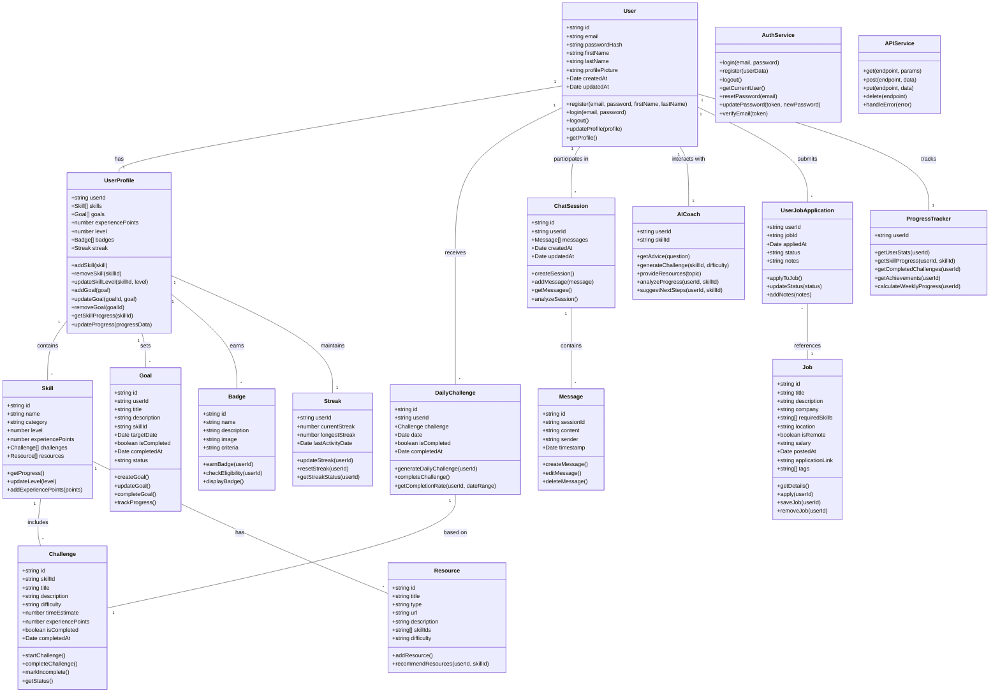

# SkillBoost - System Design Document

## Implementation Approach

For the SkillBoost web application, we'll adopt a client-server architecture with a React frontend and a RESTful API backend. Given the requirements for a responsive web application optimized for mobile viewing, we'll use the following technologies and frameworks:

### Frontend
- **React**: For building the user interface with reusable components
- **JavaScript**: As the programming language
- **Tailwind CSS**: For responsive and utility-first styling
- **Redux**: For state management
- **React Router**: For navigation between screens
- **Axios**: For API calls

### Backend
- **Node.js** with **Express.js**: For the RESTful API
- **Supabase**: For authentication, database, storage, and real-time features
- **Postgres SQL**: As the main database (provided by Supabase)

### AI Integration
- **OpenAI API**: For the AI skill coaching feature

### Hosting & Deployment
- **Vercel**: For frontend hosting
- **Supabase**: For backend services

## System Architecture Overview

The SkillBoost application follows a layered architecture:

1. **Presentation Layer**: React components using Tailwind CSS for styling
2. **State Management Layer**: Redux for global state, React Context for component-specific state
3. **Service Layer**: API service modules for communication with the backend
4. **Backend API Layer**: Express.js RESTful API endpoints
5. **Data Access Layer**: Supabase client for database operations
6. **Database Layer**: Postgres SQL tables in Supabase

## Data Structures and Interfaces

Here's the detailed class diagram for the SkillBoost system:



## API Endpoints Structure

### Authentication Endpoints
- `POST /api/auth/register` - Register a new user
- `POST /api/auth/login` - Login user
- `POST /api/auth/logout` - Logout user
- `POST /api/auth/reset-password` - Request password reset
- `PUT /api/auth/reset-password` - Update password with token
- `GET /api/auth/user` - Get current user information

### User Profile Endpoints
- `GET /api/profile` - Get user profile
- `PUT /api/profile` - Update user profile
- `GET /api/profile/skills` - Get user skills
- `POST /api/profile/skills` - Add a skill
- `PUT /api/profile/skills/:id` - Update skill level
- `DELETE /api/profile/skills/:id` - Remove skill
- `GET /api/profile/goals` - Get user goals
- `POST /api/profile/goals` - Add a goal
- `PUT /api/profile/goals/:id` - Update goal
- `DELETE /api/profile/goals/:id` - Delete goal
- `GET /api/profile/progress` - Get user progress

### Challenge Endpoints
- `GET /api/challenges/daily` - Get today's challenge
- `POST /api/challenges/daily/complete` - Complete daily challenge
- `GET /api/challenges` - Get all challenges
- `GET /api/challenges/:id` - Get specific challenge
- `GET /api/challenges/skill/:skillId` - Get challenges by skill

### Job Endpoints
- `GET /api/jobs` - Get job listings with filters
- `GET /api/jobs/:id` - Get job details
- `POST /api/jobs/apply/:id` - Apply for job
- `POST /api/jobs/save/:id` - Save job
- `DELETE /api/jobs/save/:id` - Remove saved job
- `GET /api/jobs/applications` - Get user's job applications

### Chat Endpoints
- `GET /api/chat/sessions` - Get all chat sessions
- `POST /api/chat/sessions` - Create new chat session
- `GET /api/chat/sessions/:id` - Get specific chat session
- `POST /api/chat/sessions/:id/messages` - Add message to chat
- `GET /api/chat/coach/advice` - Get AI coach advice

### Progress & Rewards Endpoints
- `GET /api/progress` - Get overall progress
- `GET /api/progress/skills/:skillId` - Get progress for specific skill
- `GET /api/badges` - Get all badges
- `GET /api/badges/earned` - Get earned badges
- `GET /api/streaks` - Get streak information

### Resource Endpoints
- `GET /api/resources` - Get learning resources
- `GET /api/resources/recommended` - Get recommended resources
- `GET /api/resources/skill/:skillId` - Get resources by skill

## Authentication Flow

1. **Registration**:
   - User enters email, password, name details
   - System validates input, checks if email already exists
   - System creates a new user account in Supabase Auth
   - System initializes user profile in the database
   - User is directed to the onboarding questionnaire

2. **Login**:
   - User enters email and password
   - System validates credentials with Supabase Auth
   - System issues JWT token on successful authentication
   - Token is stored in local storage
   - User is directed to the dashboard or previous page

3. **Logout**:
   - User clicks logout
   - System removes JWT token from local storage
   - User is redirected to login page
   - Session is terminated on backend

4. **Password Reset**:
   - User requests password reset with email
   - System sends reset link via Supabase Auth
   - User clicks link and enters new password
   - System updates password and redirects to login

5. **Authentication Middleware**:
   - Protected routes check for valid JWT token
   - Expired tokens trigger automatic logout
   - API requests include token in Authorization header

## State Management Strategy

The SkillBoost application will use a combination of Redux for global state management and React Context API for more localized state needs:

### Redux Store Structure

```
store/
├── auth/
│   ├── actions.js
│   ├── reducers.js
│   └── selectors.js
├── profile/
│   ├── actions.js
│   ├── reducers.js
│   └── selectors.js
├── skills/
│   ├── actions.js
│   ├── reducers.js
│   └── selectors.js
├── challenges/
│   ├── actions.js
│   ├── reducers.js
│   └── selectors.js
├── jobs/
│   ├── actions.js
│   ├── reducers.js
│   └── selectors.js
├── chat/
│   ├── actions.js
│   ├── reducers.js
│   └── selectors.js
└── progress/
    ├── actions.js
    ├── reducers.js
    └── selectors.js
```

### State Management Approach

1. **Global State (Redux)**:
   - User authentication state
   - User profile data
   - Skills collection
   - Current daily challenge
   - Job listings
   - Progress metrics
   - Notifications

2. **Component State (React useState)**:
   - Form inputs
   - UI state (modals, tooltips, etc.)
   - Component-specific temporary data

3. **Context API**:
   - Theme preferences
   - Feature-specific states (like chat context)
   - Localized shared state between related components

4. **Persistence Strategy**:
   - Redux state persisted using redux-persist
   - Authentication tokens stored in secure localStorage
   - Critical data cached for offline usage
   - Service workers for PWA capabilities

## Program Call Flow

For key user interactions and system flows, please refer to the separate sequence diagram file.

## Anything UNCLEAR

1. **API Integration Details**: The level of integration with third-party job listing APIs needs clarification. Will we aggregate listings from multiple sources or maintain our own job database?

2. **Monetization Strategy**: The requirements don't specify if there will be premium features or subscription tiers. This could impact the architecture design for access control.

3. **Offline Capabilities**: The extent of offline functionality needed should be clarified, as this will impact the service worker implementation and data caching strategies.

4. **Analytics Requirements**: Specific analytics tracking needs would help refine the data model and event tracking infrastructure.

5. **User Content Moderation**: If users can contribute content (e.g., in chat or job listings), a moderation strategy might be needed.

6. **Scale Expectations**: Understanding expected user volume would help refine the architecture for appropriate scaling.
